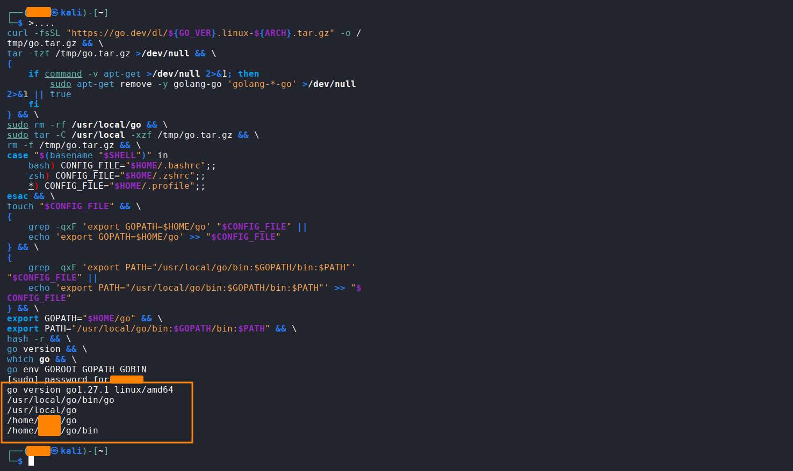
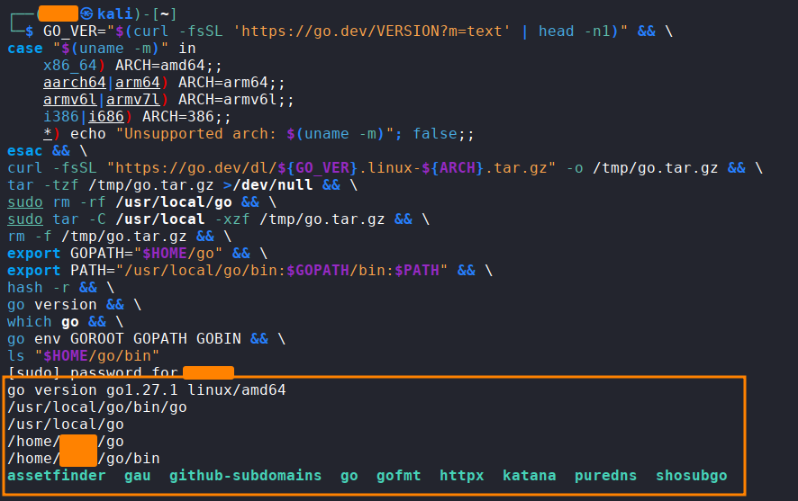

# go-setup

Install and update the latest stable Go version on Linux with a single command.



## What it does

* Detects the system architecture.
* Downloads the latest stable Go release from the official Go website.
* Verifies the archive before touching your existing installation.
* Removes conflicting `golang-go` packages installed through apt (install only).
* Installs Go under `/usr/local/go`.
* Configures `GOPATH` and adds Go and Go binaries to `PATH` (install only).
* Detects Bash, Zsh, or falls back to `~/.profile`.
* Verifies the installed Go version and environment.

## Supported Architectures

* `amd64`
* `arm64`
* `armv6l`
* `386`

## Requirements

* Linux
* `curl`
* `tar`
* `sudo`
* `apt-get` is optional

## Installation

### 1. First time? Install Go

```bash
GO_VER="$(curl -fsSL 'https://go.dev/VERSION?m=text' | head -n1)" && \
case "$(uname -m)" in
    x86_64) ARCH=amd64;;
    aarch64|arm64) ARCH=arm64;;
    armv6l|armv7l) ARCH=armv6l;;
    i386|i686) ARCH=386;;
    *) echo "Unsupported arch: $(uname -m)"; false;;
esac && \
curl -fsSL "https://go.dev/dl/${GO_VER}.linux-${ARCH}.tar.gz" -o /tmp/go.tar.gz && \
tar -tzf /tmp/go.tar.gz >/dev/null && \
{
    if command -v apt-get >/dev/null 2>&1; then
        sudo apt-get remove -y golang-go 'golang-*-go' >/dev/null 2>&1 || true
    fi
} && \
sudo rm -rf /usr/local/go && \
sudo tar -C /usr/local -xzf /tmp/go.tar.gz && \
rm -f /tmp/go.tar.gz && \
case "$(basename "$SHELL")" in
    bash) CONFIG_FILE="$HOME/.bashrc";;
    zsh) CONFIG_FILE="$HOME/.zshrc";;
    *) CONFIG_FILE="$HOME/.profile";;
esac && \
touch "$CONFIG_FILE" && \
{
    grep -qxF 'export GOPATH=$HOME/go' "$CONFIG_FILE" ||
    echo 'export GOPATH=$HOME/go' >> "$CONFIG_FILE"
} && \
{
    grep -qxF 'export PATH="/usr/local/go/bin:$GOPATH/bin:$PATH"' "$CONFIG_FILE" ||
    echo 'export PATH="/usr/local/go/bin:$GOPATH/bin:$PATH"' >> "$CONFIG_FILE"
} && \
export GOPATH="$HOME/go" && \
export PATH="/usr/local/go/bin:$GOPATH/bin:$PATH" && \
hash -r && \
go version && \
which go && \
go env GOROOT GOPATH GOBIN
```

### 2. Already installed with the command above? Update Go


This replaces only `/usr/local/go`.
Your tools installed with `go install` (such as `subfinder`, `httpx`, `nuclei`) live in `~/go/bin` and are **not** removed.

```bash
GO_VER="$(curl -fsSL 'https://go.dev/VERSION?m=text' | head -n1)" && \
case "$(uname -m)" in
    x86_64) ARCH=amd64;;
    aarch64|arm64) ARCH=arm64;;
    armv6l|armv7l) ARCH=armv6l;;
    i386|i686) ARCH=386;;
    *) echo "Unsupported arch: $(uname -m)"; false;;
esac && \
curl -fsSL "https://go.dev/dl/${GO_VER}.linux-${ARCH}.tar.gz" -o /tmp/go.tar.gz && \
tar -tzf /tmp/go.tar.gz >/dev/null && \
sudo rm -rf /usr/local/go && \
sudo tar -C /usr/local -xzf /tmp/go.tar.gz && \
rm -f /tmp/go.tar.gz && \
export GOPATH="$HOME/go" && \
export PATH="/usr/local/go/bin:$GOPATH/bin:$PATH" && \
hash -r && \
go version && \
which go && \
go env GOROOT GOPATH GOBIN && \
ls "$HOME/go/bin"
```
